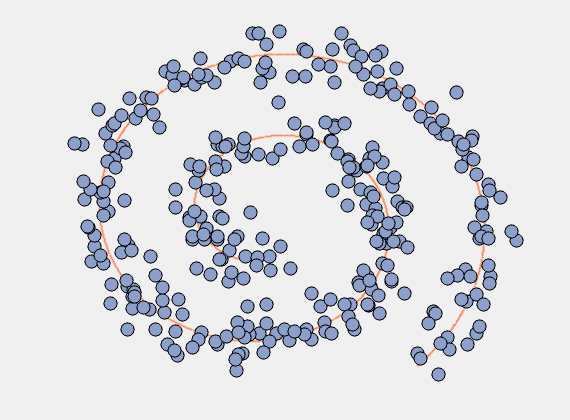

# EM3A

It perform Evolutionary Manifold Alignment Aware Agents (EM3A), which an algorithm to denoise a data set. This algorithm is presented in the following paper:
- Mohammad Mohammadi and Kerstin Bunte, "Multi-agent Based Manifold Denoising", International Conference on Intelligent Data Engineering and Automated Learning. Springer, Cham, 2020.

## Needed packages:
- numpy,
- matplotlib,
- sklearn,
- mpi4py.

# Running code
The following command will run data-driven model with the parameters.

> python main.py --input filename --outputdir dirname

where filename is the name of a .mat file containing input data set, and outputdir is the directory to save the results.

You have several options to control the behavior of the algorithm:

- etta: learning rate (0,1],
- tau: a threshold (related to residual error for PCA),
- workers: number of processors to be used (for parallelization),
- Ncarrying: number of points that an agent can move in each step,
- Nsteps: number of steps that an agent walks in each, 
- Ncolonies: number of colonies to distributed agents among them,
- Nstrategies: number of sub-intervals (or strategies) in [minradius, maxradius],
- minradius: minimum radius size (or neighborhood size),
- maxradius: maximum radius size,
- Niter: number of generations (stopping criteria)

for more details about these quantities, please check the paper. 
To use command line for entering these quantities, here is one example:

> python main.py --input filename --outputdir dirname --etta 0.5 --tau 0.01 --workers 4 --Ncarrying 5 --Nsteps 100 --Ncolonies 10 --Nstrategies 10 --minradius 0.1 --maxradius 1 --Niter 200
